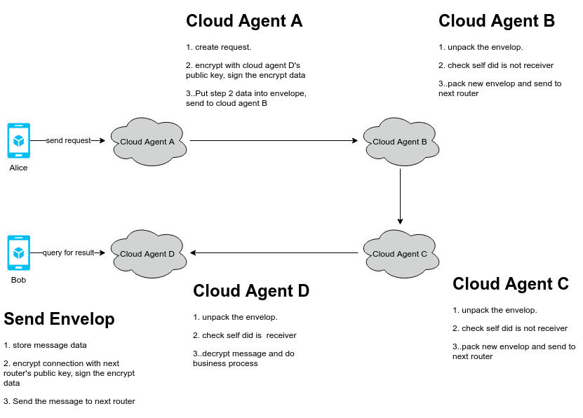

# Envelop and Encrypt Message

## 1. Overview

For some cases, agent may not be able to connect to other directly due to network setting or firewall, so they need to relay the message by routers, during the relay and forward, the original message should be encrypt, only the receiver can decrypt the message content.



## 2. Solution

We define an envelop format to contain the messages between agents.

```
{
    "message":{
        "data":"encrypt the message data",
        "msgtype": type of message(int),
        "sign":"signature of data"
    },
    "connection":{
        "data":"encrypt connection data",
        "sign":"signature of data"
    },
    "fromdid":"sender did",
    "todid":"receiver did"
}
```

The format of connection:

```
{
    "my_did": "did:ont:alice",
    "my_router":["did:ont:cloudA#serviceid","did:ont:cloundB#serviceid"],
    "their_did": "did:ont:Bob",
    "their_router":["did:ont:cloudD#serviceid","did:ont:cloudC#serviceid"]
}
```

The communication process should like below:

1. **my_router** and **their_router** must not be empty, they could only contains **my_did** and **their_did** for the directly connection case. The first element of **my_router**  and the last element of **their_router** is the delegate agent, others will be the forward agent.
2. Sender agent use the receiver agent's public key to encrypt the message, and sign the encrypt data with  his private key.
3. Sender agent use the "next router"'s public key to encrypt the connection data, and sign the encrypt data with his private key.
4. Sender agent file the data in envelop and send it to next router.
5. Next router first validate and decrypt the connection from envelop, if the receiver is the router himself, the router will do the following process, otherwise he will repeat the step 3 and pass the envelop to next router.