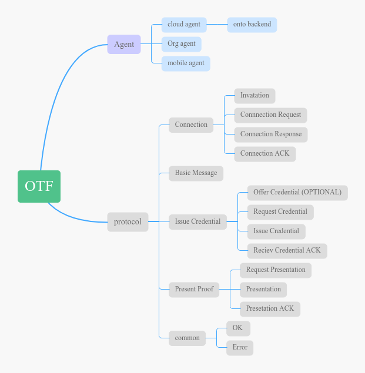
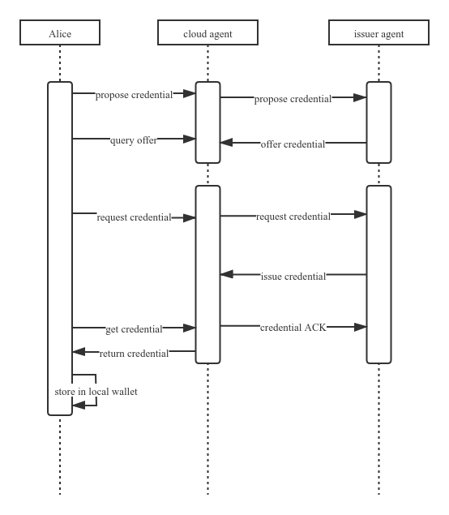
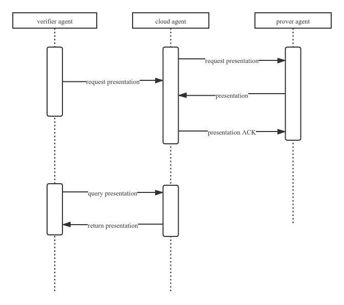

# ONTID Transport Framework Design

## 1. Introduction

TO BE ADDED


## 2. Structure




## 3. Protocols

We will use following protocols like  [Aries](https://github.com/hyperledger/aries-rfcs/blob/master/features/0160-connection-protocol/README.md)

### 3.1 Connection protocols:

Sequence:


#### 3.1.1 Invitation

An invitation is for other agent to connect 

Message sample

```json
{
    "@type": "spec/connections/1.0/invitation",
    "@id": "uuid-of-msg",
    "label": "Alice",
    "did": "did:ont:alicedid",
    "service_id":"serviceid"
}
```

**type** : message type

**id**: message uuid

**label**:invitation label

**did**: inviter's did

**service_id**:service id in didDoc

TBD: routingkey ??


#### 3.1.2 Connection Request

The invitee send connection based on the invitation

Message sample

```json
{
  "@id": "uuid",
  "@type": "spec/connections/1.0/request",
  "label": "Bob",
  "connection": {
    "my_did": "did:ont:Bobdid",
  	"my_service_id":"BobServiceID",
    "their_did":"did:ont:Alicedid",
    "their_service_id":"AliceServiceID"  
  },
  "invitation_id":"invitation_id",
}
```

**id**:message uuid

**type** : message type

**label**:connection label

**connection**:

​	**DID**: self did

​	**service_id**:service id in didDoc

#### 3.1.3 Connection Response

Message sample

```
{
  "@type": "spec/connections/1.0/response",
  "@id": "uuid-of-msg",
  "~thread": {
    "thid": "<@id of request message>"
  },
  "connection": {
    "my_did": "did:ont:Bobdid",
  	"my_service_id":"BobServiceID",
    "their_did":"did:ont:Alicedid",
    "their_service_id":"AliceServiceID" 
  }
}
```


#### 3.1.4  Acknowledgement

```
{
    "@type":"spec/connections/1.0/ack",
    "@id": "uuid-of-msg",
    "~thread": {
    	"thid": "<@id of request message>"
  	},
  	"status":"succeed",
  	"connection": {
        "my_did": "did:ont:Bobdid",
        "my_service_id":"BobServiceID",
        "their_did":"did:ont:Alicedid",
        "their_service_id":"AliceServiceID" 
      }
  }
}
```


### 3.2 Issue Credential Protocol

sequence:



#### 3.2.1 Proposal credential(optional)

potential Holder to Issuer (optional). Tells what the Holder hopes to receive.

Schema:

```json
{
    "@type": "spec/issue-credential/1.1/propose-credential",
    "@id": "<uuid-of-propose-message>",
    "comment": "some comment",
    "credential_proposal": {
        "@type":"spec/issue-credential/1.1/preview-credential",
        "attributes":[
            {
                "name":"xxx",
                "mime-type":"string",
                "value":"values"
            }
        ]
    },
    "connection": {
        "my_did": "did:ont:Bobdid",
        "my_service_id":"BobServiceID",
        "their_did":"did:ont:Alicedid",
        "their_service_id":"AliceServiceID" 
      }
}
```


#### 3.2.2 Offer credential

Issuer to potential Holder (optional for some credential implementations; Tells what the Issuer intends to issue, and possibly, the price the Issuer expects to be paid.

Schema:

```
{
    "@type": "spec/issue-credential/1.1/propose-credential",
    "@id": "<uuid-of-propose-message>",
    "comment": "some comment",
    "credential_proposal": {
        "@type":"spec/issue-credential/1.1/preview-credential",
        "attributes":[
            {
                "name":"xxx",
                "mime-type":"string",
                "value":"values"
            }
        ]
    },
     "offers~attach": [
        {
            "@id": "attachment id",
            "description":"xxx",
            "mime-type": "application/json"
        }
    ],
    "connection": {
        "my_did": "did:ont:Bobdid",
        "my_service_id":"BobServiceID",
        "their_did":"did:ont:Alicedid",
        "their_service_id":"AliceServiceID" 
      }
}
```

#### 3.2.3 Request credential

potential Holder to Issuer. If neither of the previous message types is used, this is the message that begins the protocol.

Schema:

```
{
    "@type": "did:ont:agentdid;spec/issue-credential/1.0/request-credential",
    "@id": "<uuid-of-request-message>",
    "comment": "some comment",
    "formats":[
      {
          "attachid":"attachment id",
          "format":"string",
      }  
    ],
    "requests~attach": [
        {
            "@id": "offer attachment id",
        }
    ],
    "connection": {
        "my_did": "did:ont:Bobdid",
        "my_service_id":"BobServiceID",
        "their_did":"did:ont:Alicedid",
        "their_service_id":"AliceServiceID" 
      }
}
```

**formats**:Formats contains an entry for each requests~attach array entry, providing the the value of the attachment @id and the verifiable credential format and version of the attachment.

**requests~attach**: RequestsAttach is a slice of attachments defining the requested formats for the credential, optional

#### 3.2.4 Issue credential

Issuer to new Holder. Attachment payload contains the actual credential.

Schema:

```
{
    "@type": "spec/issue-credential/1.0/issue-credential",
    "@id": "<uuid-of-issue-message>",
    "comment": "some comment",
    "formats":[
      {
          "attachid":"attachment id",
          "format":"string",
      }  
    ],
    "credentials~attach": [
        {
            "@id": "attachment id",
            "description":"xxx",
            "filename":"",
            "mime-type": "application/json",
            "lastmod_time":"timestamp",
            "byte_count":size,
            "data": {
            	"sha256":"",
            	"links":[],
                "base64": "<bytes for base64>",
                "json":{}
            }
        }
    ],
    "connection": {
        "my_did": "did:ont:Bobdid",
        "my_service_id":"BobServiceID",
        "their_did":"did:ont:Alicedid",
        "their_service_id":"AliceServiceID" 
      },
  "~thread": {
    "thid": "<@id of request message>"
  },
}
```

`credentials~attach` -- an array of attachments containing the issued credentials.


#### 3.2.5 Credential ACK

Same with 3.1.4


### 3.3 Present Proof Protocol

sequence:




#### 3.3.1 Request Presentation 

From a verifier to a prover, the `request-presentation` message describes values that need to be revealed and predicates that need to be fulfilled. Schema:

```
{
    "@type": "spec/present-proof/1.0/request-presentation",
    "@id": "<uuid-request>",
    "comment": "some comment",
    "formats":[
      {
          "attachid":"attachment id",
          "format":"string",
      }  
    ],
    "request_presentations~attach": [
        {
            "@id": "attachment id"
        }
    ],
    "connection": {
        "my_did": "did:ont:Bobdid",
        "my_service_id":"BobServiceID",
        "their_did":"did:ont:Alicedid",
        "their_service_id":"AliceServiceID" 
      }
}
```

#### 3.3.2 Presentation

This message is a response to a Presentation Request message and contains signed presentations. Schema:

```
{
    "@type": "spec/present-proof/1.0/presentation",
    "@id": "<uuid-presentation>",
    "comment": "some comment",
    "formats":[
      {
          "attachid":"attachment id",
          "format":"string",
      }  
    ],
    "presentations~attach": [
        {
            "@id": "attachment id",
            "mime-type": "application/json",
            "data": {
                "base64": "<bytes for base64>",
                "json":{}
            }
        }
    ],
    "connection": {
        "my_did": "did:ont:Bobdid",
        "my_service_id":"BobServiceID",
        "their_did":"did:ont:Alicedid",
        "their_service_id":"AliceServiceID" 
      }
}
```

#### 3.3.3 Presentation ACK

Same with 3.1.4


### 3.4 Basic message

Message is message model for basic message protocol

```json
{
    "@type":"spec/basic-message/1.0/message"
    "@id": "<uuid-presentation>",
	"sent_time":timestamp,
	"content": string,
	"~I10n":{
        "local":"en"
	},
	"connection": {
        "my_did": "did:ont:Bobdid",
        "my_service_id":"BobServiceID",
        "their_did":"did:ont:Alicedid",
        "their_service_id":"AliceServiceID" 
      }
}
```


## 4. Envelop and Encrypt

### 4.1 Authcrypt mode vs. Anoncrypt mode

When packing and unpacking are done in a way that the sender is anonymous, we say that we are in **anoncrypt mode**. When the sender is revealed, we are in **authcrypt mode**. Authcrypt mode reveals the sender *to the recipient only*; it is not the same as a non-repudiable signature.

This is an example of an outputted message encrypting for two verkeys using Authcrypt.

```
{
    "protected": "eyJlbmMiOiJ4Y2hhY2hhMjBwb2x5MTMwNV9pZXRmIiwidHlwIjoiSldNLzEuMCIsImFsZyI6IkF1dGhjcnlwdCIsInJlY2lwaWVudHMiOlt7ImVuY3J5cHRlZF9rZXkiOiJMNVhEaEgxNVBtX3ZIeFNlcmFZOGVPVEc2UmZjRTJOUTNFVGVWQy03RWlEWnl6cFJKZDhGVzBhNnFlNEpmdUF6IiwiaGVhZGVyIjp7ImtpZCI6IkdKMVN6b1d6YXZRWWZOTDlYa2FKZHJRZWpmenRONFhxZHNpVjRjdDNMWEtMIiwiaXYiOiJhOEltaW5zdFhIaTU0X0otSmU1SVdsT2NOZ1N3RDlUQiIsInNlbmRlciI6ImZ0aW13aWlZUkc3clJRYlhnSjEzQzVhVEVRSXJzV0RJX2JzeERxaVdiVGxWU0tQbXc2NDE4dnozSG1NbGVsTThBdVNpS2xhTENtUkRJNHNERlNnWkljQVZYbzEzNFY4bzhsRm9WMUJkREk3ZmRLT1p6ckticUNpeEtKaz0ifX0seyJlbmNyeXB0ZWRfa2V5IjoiZUFNaUQ2R0RtT3R6UkVoSS1UVjA1X1JoaXBweThqd09BdTVELTJJZFZPSmdJOC1ON1FOU3VsWXlDb1dpRTE2WSIsImhlYWRlciI6eyJraWQiOiJIS1RBaVlNOGNFMmtLQzlLYU5NWkxZajRHUzh1V0NZTUJ4UDJpMVk5Mnp1bSIsIml2IjoiRDR0TnRIZDJyczY1RUdfQTRHQi1vMC05QmdMeERNZkgiLCJzZW5kZXIiOiJzSjdwaXU0VUR1TF9vMnBYYi1KX0pBcHhzYUZyeGlUbWdwWmpsdFdqWUZUVWlyNGI4TVdtRGR0enAwT25UZUhMSzltRnJoSDRHVkExd1Z0bm9rVUtvZ0NkTldIc2NhclFzY1FDUlBaREtyVzZib2Z0d0g4X0VZR1RMMFE9In19XX0=",
    "iv": "ZqOrBZiA-RdFMhy2",
    "ciphertext": "K7KxkeYGtQpbi-gNuLObS8w724mIDP7IyGV_aN5AscnGumFd-SvBhW2WRIcOyHQmYa-wJX0MSGOJgc8FYw5UOQgtPAIMbSwVgq-8rF2hIniZMgdQBKxT_jGZS06kSHDy9UEYcDOswtoLgLp8YPU7HmScKHSpwYY3vPZQzgSS_n7Oa3o_jYiRKZF0Gemamue0e2iJ9xQIOPodsxLXxkPrvvdEIM0fJFrpbeuiKpMk",
    "tag": "kAuPl8mwb0FFVyip1omEhQ=="
}
```


- receiver_verkeys: a list of recipient verkeys as string containing a JSON array
- sender_verkey: the sender's verkey as a string. This verkey is used to look up the sender's private key so the wallet can put supply it as input to the encryption algorithm. When an empty string ("") is passed in this parameter, anoncrypt mode is used

The base64URL encoded `protected` decodes to this:

```
{
    "enc": "xchacha20poly1305_ietf",
    "typ": "JWM/1.0",
    "alg": "Authcrypt",
    "recipients": [
        {
            "encrypted_key": "L5XDhH15Pm_vHxSeraY8eOTG6RfcE2NQ3ETeVC-7EiDZyzpRJd8FW0a6qe4JfuAz",
            "header": {
                "kid": "GJ1SzoWzavQYfNL9XkaJdrQejfztN4XqdsiV4ct3LXKL",
                "iv": "a8IminstXHi54_J-Je5IWlOcNgSwD9TB",
                "sender": "ftimwiiYRG7rRQbXgJ13C5aTEQIrsWDI_bsxDqiWbTlVSKPmw6418vz3HmMlelM8AuSiKlaLCmRDI4sDFSgZIcAVXo134V8o8lFoV1BdDI7fdKOZzrKbqCixKJk="
            }
        },
        {
            "encrypted_key": "eAMiD6GDmOtzREhI-TV05_Rhippy8jwOAu5D-2IdVOJgI8-N7QNSulYyCoWiE16Y",
            "header": {
                "kid": "HKTAiYM8cE2kKC9KaNMZLYj4GS8uWCYMBxP2i1Y92zum",
                "iv": "D4tNtHd2rs65EG_A4GB-o0-9BgLxDMfH",
                "sender": "sJ7piu4UDuL_o2pXb-J_JApxsaFrxiTmgpZjltWjYFTUir4b8MWmDdtzp0OnTeHLK9mFrhH4GVA1wVtnokUKogCdNWHscarQscQCRPZDKrW6boftwH8_EYGTL0Q="
            }
        }
    ]
}
```

#### pack output format (Authcrypt mode)

```
    {
        "protected": "b64URLencoded({
            "enc": "xchachapoly1305_ietf",
            "typ": "JWM/1.0",
            "alg": "Authcrypt",
            "recipients": [
                {
                    "encrypted_key": base64URLencode(libsodium.crypto_box(my_key, their_vk, cek, cek_iv))
                    "header": {
                          "kid": "base58encode(recipient_verkey)",
                           "sender" : base64URLencode(libsodium.crypto_box_seal(their_vk, base58encode(sender_vk)),
                            "iv" : base64URLencode(cek_iv)
                }
            },
            ],
        })",
        "iv": <b64URLencode(iv)>,
        "ciphertext": b64URLencode(encrypt_detached({'@type'...}, protected_value_encoded, iv, cek),
        "tag": <b64URLencode(tag)>
    }
```

This is an example of an outputted message encrypted for two verkeys using Anoncrypt.

```
{
    "protected": "eyJlbmMiOiJ4Y2hhY2hhMjBwb2x5MTMwNV9pZXRmIiwidHlwIjoiSldNLzEuMCIsImFsZyI6IkFub25jcnlwdCIsInJlY2lwaWVudHMiOlt7ImVuY3J5cHRlZF9rZXkiOiJYQ044VjU3UTF0Z2F1TFcxemdqMVdRWlEwV0RWMFF3eUVaRk5Od0Y2RG1pSTQ5Q0s1czU4ZHNWMGRfTlpLLVNNTnFlMGlGWGdYRnZIcG9jOGt1VmlTTV9LNWxycGJNU3RqN0NSUHNrdmJTOD0iLCJoZWFkZXIiOnsia2lkIjoiR0oxU3pvV3phdlFZZk5MOVhrYUpkclFlamZ6dE40WHFkc2lWNGN0M0xYS0wifX0seyJlbmNyeXB0ZWRfa2V5IjoiaG5PZUwwWTl4T3ZjeTVvRmd0ZDFSVm05ZDczLTB1R1dOSkN0RzRsS3N3dlljV3pTbkRsaGJidmppSFVDWDVtTU5ZdWxpbGdDTUZRdmt2clJEbkpJM0U2WmpPMXFSWnVDUXY0eVQtdzZvaUE9IiwiaGVhZGVyIjp7ImtpZCI6IjJHWG11Q04ySkN4U3FNUlZmdEJITHhWSktTTDViWHl6TThEc1B6R3FRb05qIn19XX0=",
    "iv": "M1GneQLepxfDbios",
    "ciphertext": "iOLSKIxqn_kCZ7Xo7iKQ9rjM4DYqWIM16_vUeb1XDsmFTKjmvjR0u2mWFA48ovX5yVtUd9YKx86rDVDLs1xgz91Q4VLt9dHMOfzqv5DwmAFbbc9Q5wHhFwBvutUx5-lDZJFzoMQHlSAGFSBrvuApDXXt8fs96IJv3PsL145Qt27WLu05nxhkzUZz8lXfERHwAC8FYAjfvN8Fy2UwXTVdHqAOyI5fdKqfvykGs6fV",
    "tag": "gL-lfmD-MnNj9Pr6TfzgLA=="
}
```

The protected data decodes to this:

```
{
    "enc": "xchacha20poly1305_ietf",
    "typ": "JWM/1.0",
    "alg": "Anoncrypt",
    "recipients": [
        {
            "encrypted_key": "XCN8V57Q1tgauLW1zgj1WQZQ0WDV0QwyEZFNNwF6DmiI49CK5s58dsV0d_NZK-SMNqe0iFXgXFvHpoc8kuViSM_K5lrpbMStj7CRPskvbS8=",
            "header": {
                "kid": "GJ1SzoWzavQYfNL9XkaJdrQejfztN4XqdsiV4ct3LXKL"
            }
        },
        {
            "encrypted_key": "hnOeL0Y9xOvcy5oFgtd1RVm9d73-0uGWNJCtG4lKswvYcWzSnDlhbbvjiHUCX5mMNYulilgCMFQvkvrRDnJI3E6ZjO1qRZuCQv4yT-w6oiA=",
            "header": {
                "kid": "2GXmuCN2JCxSqMRVftBHLxVJKSL5bXyzM8DsPzGqQoNj"
            }
        }
    ]
}
```

#### pack output format (Anoncrypt mode)

```
    {
         "protected": "b64URLencoded({
            "enc": "xchachapoly1305_ietf",
            "typ": "JWM/1.0",
            "alg": "Anoncrypt",
            "recipients": [
                {
                    "encrypted_key": base64URLencode(libsodium.crypto_box_seal(their_vk, cek)),
                    "header": {
                        "kid": base58encode(recipient_verkey),
                    }
                },
            ],
         })",
         "iv": b64URLencode(iv),
         "ciphertext": b64URLencode(encrypt_detached({'@type'...}, protected_value_encoded, iv, cek),
         "tag": b64URLencode(tag)
    }
```


## 


